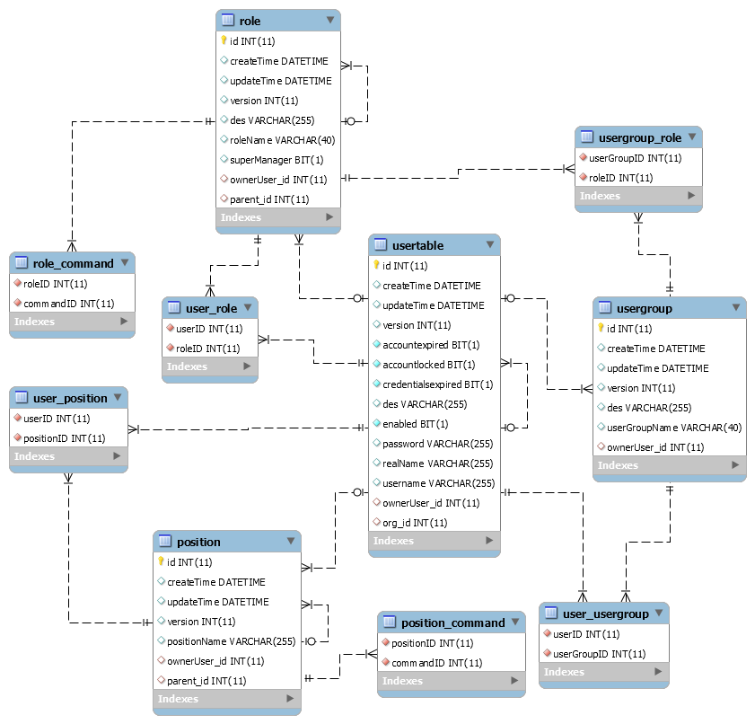

# ER
Entity–relationship


## 实体约束关系

1. 1:1  
2. 1:N
3. N:1
4. M:N


```html
CREATE TABLE IF NOT EXISTS `apdplat`.`role` (
  `id` INT(11) NOT NULL AUTO_INCREMENT,
  `createTime` DATETIME NULL DEFAULT NULL,
  `updateTime` DATETIME NULL DEFAULT NULL,
  `version` INT(11) NULL DEFAULT NULL,
  `des` VARCHAR(255) NULL DEFAULT NULL,
  `roleName` VARCHAR(40) NULL DEFAULT NULL,
  `superManager` BIT(1) NULL DEFAULT NULL,
  `ownerUser_id` INT(11) NULL DEFAULT NULL,
  `parent_id` INT(11) NULL DEFAULT NULL,
  PRIMARY KEY (`id`),
  UNIQUE INDEX `UK_9w2skwb5squ3usiaiml4iw9e7` (`roleName` ASC),
  INDEX `FK_1ca72yvknpd7docd76483toq1` (`ownerUser_id` ASC),
  INDEX `FK_6kam45042t1yfigt5simy3iqp` (`parent_id` ASC),
  CONSTRAINT `FK_1ca72yvknpd7docd76483toq1`
    FOREIGN KEY (`ownerUser_id`)
    REFERENCES `apdplat`.`usertable` (`id`),
  CONSTRAINT `FK_6kam45042t1yfigt5simy3iqp`
    FOREIGN KEY (`parent_id`)
    REFERENCES `apdplat`.`role` (`id`))
ENGINE = InnoDB
AUTO_INCREMENT = 5
DEFAULT CHARACTER SET = utf8
```

[WorkBench Download](http://cdn.mysql.com/Downloads/MySQLGUITools/mysql-workbench-community-6.3.6-winx64.msi)