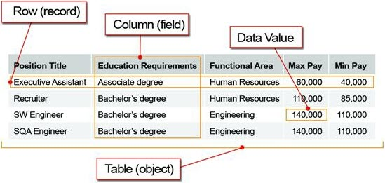

# 概念
## 重要概念

一定要知道的:

- 数据库是有组织的数据集合 (database)
- 数据表保存了某一类数据 (table、object)

用户表保存了用户的数据

订单表保存了订单的数据

- 数据行（record、row）
- 字段（column、field）



### [字段类型](mysql_data_type.html)
MySQL支持多种字段类型：**数值类型、日期/时间类型和字符串(字符)类型**

几种字段类型描述使用了下述惯例：

- M

表示最大显示宽度。最大有效显示宽度是255。

MySQL还支持选择在该类型关键字后面的括号内指定整数值的显示宽度(例如，INT(4))。该可选显示宽度规定用于显示宽度小于指定的列宽度的值时从左侧填满宽度。

显示宽度并不限制可以在列内保存的值的范围，也不限制超过列的指定宽度的值的显示。

当结合可选扩展属性ZEROFILL使用时， 默认补充的空格用零代替。例如，对于声明为INT(5) ZEROFILL的列，值4检索为00004。请注意如果在整数列保存超过显示宽度的一个值，当MySQL为复杂联接生成临时表时会遇到问题，因为在这些情况下MySQL相信数据适合原列宽度。


## MySQL

1. 关系数据库
2. 客户服务器体系
3. 支持 事务、子查询、视图、函数、存储过程、触发器等特性

### 数据表类型

- MyISAM
- InnoDB
- MEMORY 内存表
- ...

```html
 MariaDB [(none)]> show engines;
+--------------------+---------+----------------------------------------------------------------------------+--------------+------+------------+
| Engine             | Support | Comment                                                                    | Transactions | XA   | Savepoints |
+--------------------+---------+----------------------------------------------------------------------------+--------------+------+------------+
| CSV                | YES     | CSV storage engine                                                         | NO           | NO   | NO         |
| MRG_MYISAM         | YES     | Collection of identical MyISAM tables                                      | NO           | NO   | NO         |
| MEMORY             | YES     | Hash based, stored in memory, useful for temporary tables                  | NO           | NO   | NO         |
| BLACKHOLE          | YES     | /dev/null storage engine (anything you write to it disappears)             | NO           | NO   | NO         |
| MyISAM             | YES     | MyISAM storage engine                                                      | NO           | NO   | NO         |
| InnoDB             | DEFAULT | Percona-XtraDB, Supports transactions, row-level locking, and foreign keys | YES          | YES  | YES        |
| ARCHIVE            | YES     | Archive storage engine                                                     | NO           | NO   | NO         |
| FEDERATED          | YES     | FederatedX pluggable storage engine                                        | YES          | NO   | YES        |
| PERFORMANCE_SCHEMA | YES     | Performance Schema                                                         | NO           | NO   | NO         |
| Aria               | YES     | Crash-safe tables with MyISAM heritage                                     | NO           | NO   | NO         |
+--------------------+---------+----------------------------------------------------------------------------+--------------+------+------------+
```

### 视图 View
虚拟表

使用场景：

- 经常用到多个表，简化查询语句

比如：有一张商品表，我们经常要查每个栏目下商品的平均价格

select cat_id, avg(shop_price) as avg_price from goods group by by cat_id;

- 权限控制
把表的权限封闭，但是开放相应的视图权限，视图里只开放部分数据列


### [存储过程](trigger_sp.md)
Stored procedure, SP

一些由MySQL服务器直接存储和执行的定制过程或函数。 

业务逻辑固化到了数据库软件。

优点：

- 更快的速度
1. 减少了程序与数据库的交互次数 

2. 是数据库对SP代码进行了预处理（类似编译器对源代码的编译）

- 避免代码冗余

- 提高了数据库的安全性
程序可以不知道数据库结构，只要调用相关SP就可以了。


#### 触发器 [trigger](trigger_sp.md)
是在INSERT UPDATE DELETE命令之前或之后对SQL命令或SP的自动调用。

触发器（trigger）是数据库提供给程序员和数据分析员来保证数据完整性的一种方法，
它是与表事件相关的特殊的储存过程，它的执行不是由程序调用，也不是手工启动，
而是由事件来触发，当对一个表进行操作（insert，delete，update）时就会激活它执行。

触发器经常用于加强数据的完整性约束和业务规则等。


```html
机械
...
数码
├── 手机
│   └── 智能机
│       └── Android
│       └── SMA
├── 电脑
│   ├── 服务器
│   ├── 笔记本
```

使用方：A 网站 B 移动端 C 后台管理 D 第三方平台


  
